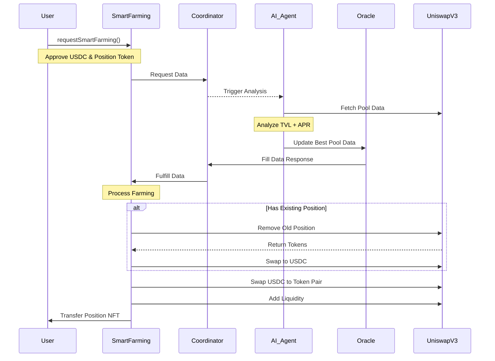
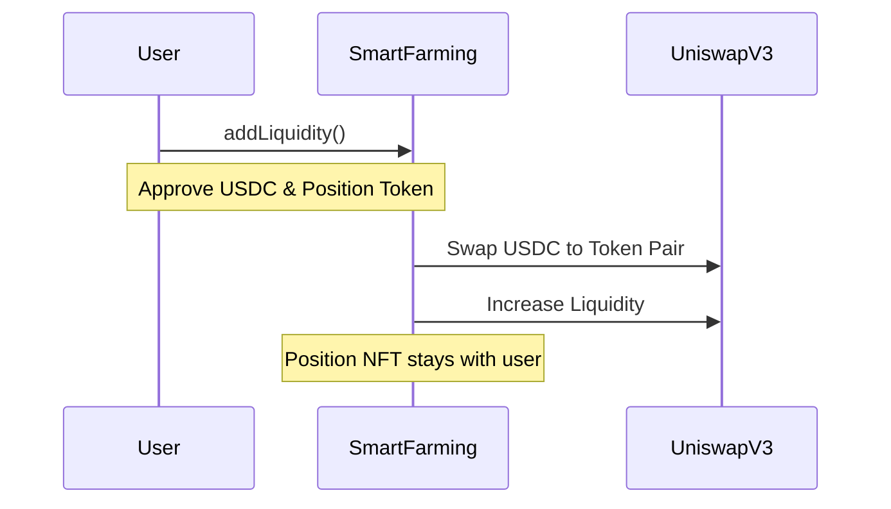
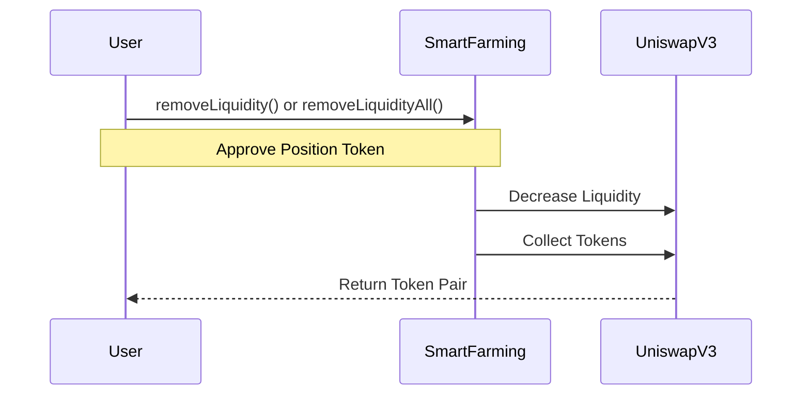
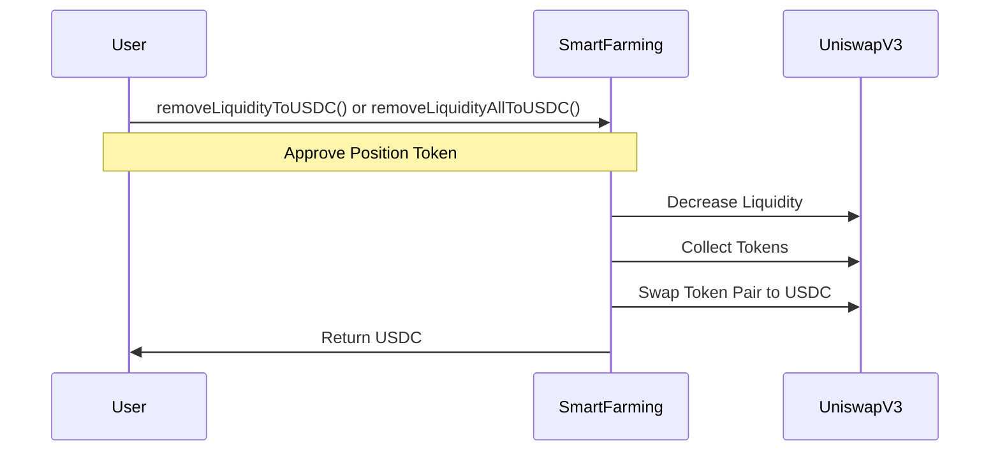

# Docs Smart Farming

## Idea

- I want to use AI agents to analyze Uniswap v3 liquidity data in Base blockchain. From there, find the pool with the best APR and use ADCS as an on-chain AI Oralce to make farming decisions on the pool with the best APR and TVL.

- The data will be mainly concentrated on Uniswap v3 Base blockchain.

- Users simply keep USDC in their wallet and trigger transaction start farming. Let Smart Farming take care of the rest.

## Feature

1. Smart Farming
2. Add more liquidity
3. Remove liquidity
4. Remove liquidity and convert all to USDC

## How to work

### 1. Smart Farming

- Step 1: User approved USDC and trigger `requestSmartFarming` with consumer `SmartFarming` smart contract
- Step 2: `SmartFarming` will create a request to `Coordinator` smart contract
- Step 3: AI agents off-chain will fetch data from Uniswap v3 by Subgraph and analyze data -> suggest best pool farming (base TVL + APR)
- Step 4: AI use Oracle smart contract to update data into `Coordinator` smart contract and trigger fill data for respone of request id
- Step 5: Fill data will trigger decision process farming
- Step 6: In final of `_addLiquidity` function of process farming will transfer position token id of LP back to user

- All setps `SmartFarming` only like a middle contract. It not keep fund of user.

### 2. Increase more liquidity ( simple steps add liquidity into )

### 3. Remove liquidity ( simple steps )

### 4. Remove liquidity and convert all to USDC ( simple steps )

## Smart Farming Flow

### 1. Smart Farming Flow



### 2. Add More Liquidity Flow



### 3. Remove Liquidity Flow



### 4. Remove Liquidity to USDC Flow



## Run test

```
forge test --match-contract SmartFarmingTest --match-test test_RequestNewFarmingAndFulfillData -vvvv
```
