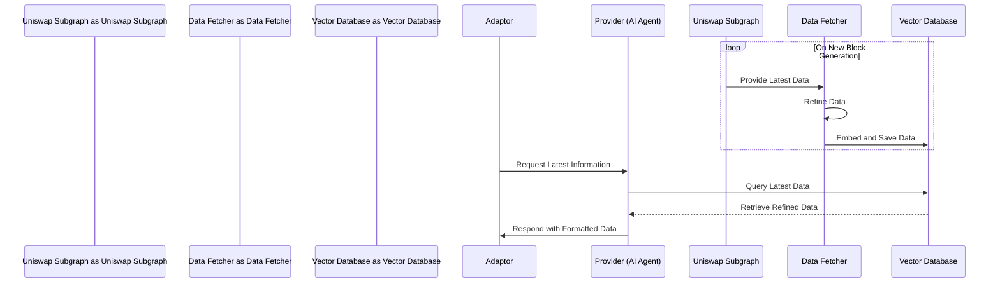

# Docs Provider Smart Farming

## Idea

- Smart Farming's AI agent is an AI with a continuously updated memory. By using a RAG system that updates real-time data to a non-fine-tuned memory. The RAG memory, because it is not fine-tuned, only needs to be retrieved by the AI ​​model, so the data can be continuously updated without waiting for the fine-tune time to update the model's knowledge.

- Its main knowledge is about pools information on Uniswap.

## How to work

- The latest data on Uniswap will be continuously fetched every time new blocks are generated. By using Uniswap's subgraph

- The data will then be refined and embedded and saved to the vector database - a normal database for easy retrieval.

- Every time there is a request from the adaptors, it will retrieve and query the latest data, then refine it according to the required format and respond to the requester (smart contract request).

- In addition, this AI agent also integrates auto detect modules if the data is not in the knowledge or vector database. It will call the APIs that are supported inside. In the future, auto search will be integrated.

